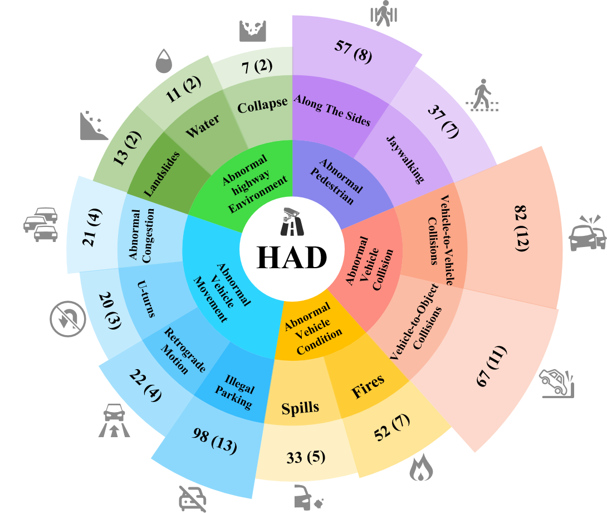

# DCDT
***
This is the official project website of our paper: *Breakthrough in Fine-Grained Video Anomaly
Detection on Highway: New Benchmark and Model*.
We introduce a new lagre-scale benchmark and a novel model to advance research in video anomaly detection.

##  Highway Anomaly Dataset
***
We present the Highway Anomaly Dataset (HAD), which includes descriptions for video. This dataset is designed to facilitate research in video anomaly detection and multimodal learning.
It can further promote the construction of intelligent transportation systems.
 
The HAD dataset focuses on anomaly detection in highway. It consists of long, untrimmed videos that cover a variety of weather conditions, including real and comprehensive highway anomalies. These raw videos are mainly collected from hundreds of actual CCTV cameras installed on highways. HAD is designed for application in road monitoring systems to support traffic management and emergency response.

## Features
***
[Baidu Netdisk](https://pan.baidu.com/s/1AGZOMva99J13n3UpdlOF7g)

##  Model
***
We propose a new multi-modal training framework for accurate anomaly detection. The full details will be disclosed in our upcoming publication and we will make the dataset publicly available for the community to explore.

##  Contact
***
For any queries or potential collaborations, please contact us at: [Email Me](mengchenlin0108@163.com)
