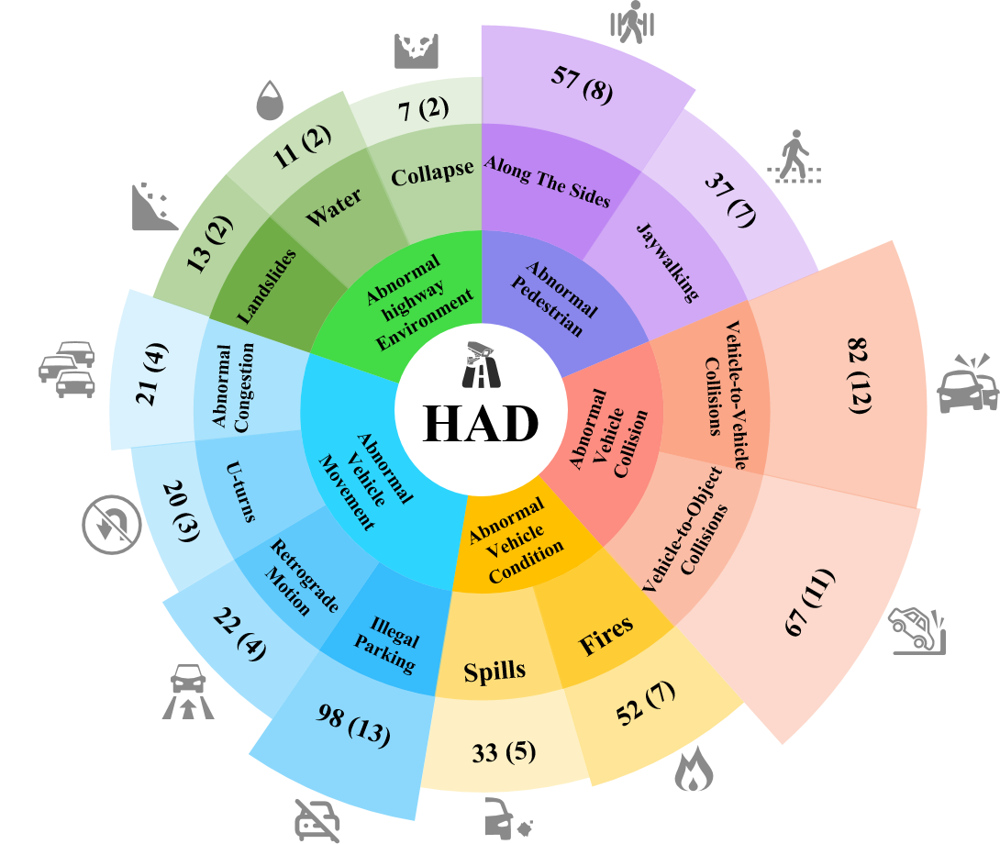

# Breakthrough in Fine-Grained Video Anomaly Detection on Highway: New Benchmark and Model
Our paper has been accepted by the journal Expert Systems with Applications!
For further details, please refer to [here](https://doi.org/10.1016/j.eswa.2025.129127).
This is the official project website of our paper: *Breakthrough in Fine-Grained Video Anomaly
Detection on Highway: New Benchmark and Model*.
We introduce a new lagre-scale benchmark and a novel model to advance research in video anomaly detection.

##  Highway Anomaly Dataset
We present the Highway Anomaly Dataset (HAD), which includes descriptions for video. This dataset is designed to facilitate research in video anomaly detection and multimodal learning.
It can further promote the construction of intelligent transportation systems.
 
 <div align="center">

</div>

The HAD dataset focuses on anomaly detection in highway. It consists of long, untrimmed videos that cover a variety of weather conditions, including real and comprehensive highway anomalies. These raw videos are mainly collected from hundreds of actual CCTV cameras installed on highways. HAD is designed for application in road monitoring systems to support traffic management and emergency response.


## Features
[Baidu Netdisk](https://pan.baidu.com/s/1AGZOMva99J13n3UpdlOF7g)

##  Model
We propose a new multi-modal training framework for accurate anomaly detection. The full details will be disclosed in our upcoming publication and we will make the dataset publicly available for the community to explore.

##  Contact
For any queries or potential collaborations, please contact us at: [Email Me](mengchenlin0108@163.com)

##  Citation

If you find our work useful in your research, please consider citing: 

```
@article{MENG2026129127,
title = {Breakthrough in fine-grained video anomaly detection on highway: New benchmark and model},
journal = {Expert Systems with Applications},
volume = {296},
pages = {129127},
year = {2026},
issn = {0957-4174},
doi = {https://doi.org/10.1016/j.eswa.2025.129127},
url = {https://www.sciencedirect.com/science/article/pii/S0957417425027447},
author = {Chenlin Meng and Xin Wang and Chi Zhang and Zhaoyong Mao and Junge Shen and Zhiyong Cheng},
keywords = {Video anomaly detection, Multi-modal learning, Highway anomaly dataset, Surveillance camera, Video analysis},
abstract = {Automatic detection of anomalies is critical for surveillance video analysis, especially for highway videos. In contrast to traditional coarse-grained methods, which only focus on identifying abnormal video clips, fine-grained detection more effectively meets practical demands. Because it can further classify the specific anomaly types which helps monitoring systems issue targeted alerts. Nevertheless, existing research often overlooks the semantic information in video descriptions, which is essential for capturing the fine contextual relationship between anomalies. Therefore, it is extremely necessary to explore how to utilize the description information to enhance fine-grained video anomaly detection. To achieve this, we construct the first Highway Anomaly Dataset (HAD) containing video descriptions and propose a novel multi-modal training paradigm called Dual-Classification with Dual-Text (DCDT). It integrates coarse-grained binary classification and fine-grained multi-class classification tasks, involving both description text and label text. In DCDT, we leverage video-description alignment to increase the intra-class similarity for normal events and inter-class differences among anomalies, while adopting video-label alignment to distinguish between normal and various types of anomalies. Experimental results demonstrate that DCDT achieves superior performance on our proposed HAD benchmark, as well as on the widely-used UCF-Crime and XD-Violence datasets. Furthermore, the HAD dataset provides an innovative platform for research in video analysis and multi-modal learning.}
}
```
